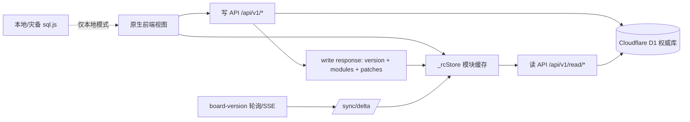
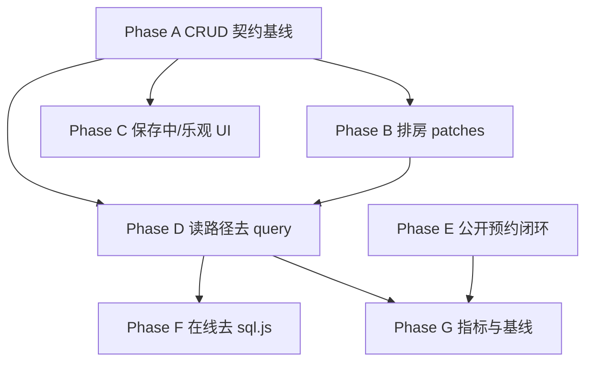

# CRUD 与在线读写链路迁移计划

> 状态：主体已落地，验收补强中  
> 日期：2026-07-03  
> 目标：把客堂系统从“在线可用 + 兼容 sql.js 过渡态”迁到“D1 权威、读写分离、模块化 read API、可观测、多端一致”的稳定多用户架构。

## 1. 设计原则

本计划对齐通用 PMS / ERP / 协作型 SaaS 的工程实践，但保持本项目原生 HTML/CSS/JS、Cloudflare Pages Functions + D1 的约束。

1. **D1 是唯一权威写库**：浏览器只保留缓存、离线灾备和本地测试能力，不再作为在线事实源。
2. **读写分离**：写走 `/api/v1/*`，读走 `/api/v1/read/*`、`/api/v1/sync/delta` 和资源详情 API。
3. **命令返回最小一致性包**：每个写 API 返回 `board_version`、`changed_domains`、`changed_modules`，能返回行级 `patches/deletions` 的必须返回。
4. **先正确，再快，再轻**：先保证 CRUD 后所有端一致，再减少全量重拉，再做乐观 UI，最后去 `sql.js`。
5. **渐进迁移，不大爆炸重写**：每个阶段必须可单独上线、可回滚、可用测试证明。
6. **在线与本地模式边界清晰**：在线路径不得依赖 `query()`；本地/灾备/migration 测试可继续使用 sql.js。
7. **按用户工作流验收**：挂单、退房、换床、用斋、预约、营期、排房、报表、历史、权限必须按实际客堂操作链路验证。

## 2. 目标架构



终局要求：

- 在线模式首屏、日常视图、写后刷新不触发 sql.js hydrate。
- 所有业务写操作都有明确同步域和模块；高频写操作有行级 patches。
- 所有主要读视图从 `_rcStore` 或 read API 取数；`query()` 仅留在 `isLocalForceDb()`、migration、灾备路径。
- 高频操作至少有保存中状态；信息管理保留乐观 UI，高频小范围操作逐步增加可回滚乐观反馈。

## 3. 当前差距

| 区域       | 当前状态                                             | 差距                                                       |
| ---------- | ---------------------------------------------------- | ---------------------------------------------------------- |
| 核心写 API | 核心业务、排房、运营设置已接 `finishWrite` / `enrichWriteResponse` | 公开预约与生产域契约仍需持续巡检                          |
| 乐观 UI    | 信息管理、高频写按钮、部分小范围操作已有保存中/乐观反馈 | 入住/退房/换床仍保持低风险 L1，不做完整乐观                |
| 读路径     | D1–D6 在线热路径已迁到 `rc*` / read API，并有边界守卫 | 非热路径本地 fallback 仍保留；继续做语义 parity 抽样        |
| 排房       | 读走 event detail / `rooming-read.js`，写返回行级 patches | 冲突检查仍为服务端计算 action，后续可独立改成 read endpoint |
| 同步       | `board_version`、delta、SSE、写后 patch 主体可用       | 还缺按模块的延迟指标、失败重试可观测性                     |
| sql.js     | 在线不加载 wasm；本地/灾备动态加载                    | 本地 migration / 灾备恢复仍需保留并定期验证                |

## 4. 分阶段计划

### Phase A：建立 CRUD 契约基线

目标：先防止继续产生“写成功但其他端不刷新”的回归。

范围：

- 所有写 API 路由必须有 `requirePermission()`。
- 所有写 API 必须返回 `finishWrite()` 元数据。
- 高频写 API 必须通过 `enrichWriteResponse()` 返回行级 patches 或 tombstone。
- 前端所有在线写入口必须调用 `rcRefreshAfterWrite()` 或业务封装。

核心路径已完成：

- 新增 `test_online_write_response_contract.py`。
- 补齐会写 `meals` 的挂单、预约转入住、删除挂单、禅营批量成员同步模块。
- 修复禅营成员批量操作后回到成员页。

剩余任务：

1. 扩展契约测试覆盖排房 API：`generate/save/publish/republish/process_queue/update_queue/log_adjustment`。
2. 扩展运营设置测试：`operational-settings` 返回设置 patch 或 read-module 可即时刷新。
3. 扩展公开预约：成功提交、关闭开关、频率限制、后台预约可见。

验收：

```bash
python3 test_online_write_response_contract.py
python3 test_write_patches.py
python3 test_write_sync_contract.py
python3 test_online_write_guard.py
npm run lint:ci
```

### Phase B：补齐排房写路径 patches

目标：把排房从“invalidate + 全量重拉”迁到“返回变更行 + 局部刷新”。

范围：

- `functions/_shared/rooming-plans.js`
- `functions/_shared/rooming-publish.js`
- `js/rooming-read.js`
- `js/rooming-plans.js`
- `js/rooming-publish.js`
- `js/rooming-adjustments.js`

最佳实践对齐：

- 类似 Directus / Supabase Realtime 的行级变更包：写命令返回修改后的 `rooming_plans`、`rooming_assignments`、`rooming_checkin_queue`、`rooming_adjustments`。
- 类似 CQRS：排房详情 API 仍可作为对账读模型，但写后主路径不依赖整包重拉。

任务：

1. 为 `generateRoomingPlanAssignments()` 返回 plan + assignments patches。
2. 为 `saveRoomingPlan()` 返回被更新 assignments patches。
3. 为 `publishRoomingPlan()` / `republishRoomingPlan()` 返回 queue patches。
4. 为 `processRoomingQueueCheckin()` 返回 queue、lodger/reservation、bed、meals patches。
5. 为 `logRoomingAdjustment()` 返回 adjustment patch。
6. 修改 `roomingRefreshAfterWrite()`：有完整 patches 时不强制 `rcEnsureEventRooming(eventId, true)`，后台对账保留 quiet。

验收：

- 排房生成、保存、发布、办理队列后 Network 不再立即全量重拉 event detail。
- 两端登录：A 发布排房，B 在 2 秒内看到队列变化。
- `rooming_checkin_queue` 办理后 board、events、meals 同步一致。

建议新增测试：

- `test_rooming_write_patches.py`
- `test_rooming_online_journey.py`（可 SKIP 云端登录失败）

### Phase C：高频写操作增加保存中状态与可回滚乐观 UI

目标：解决“网络慢时像卡住”的体感问题。

分级策略：

| 级别        | 适用操作                                   | UI 策略                               | 回滚策略                 |
| ----------- | ------------------------------------------ | ------------------------------------- | ------------------------ |
| L1 保存中   | 入住、退房、换床、用斋、预约、营期         | 禁用按钮 + 文案“保存中…” + 防重复提交 | API 失败恢复按钮并提示   |
| L2 局部乐观 | 用斋勾选、房务状态、预约状态、禅营成员取消 | 先 patch `_rcStore` 再后台写          | 失败 forceFetch 当前模块 |
| L3 完整乐观 | 信息管理 CRUD                              | 已有 `infoApplyOptimistic`            | 已有 `infoRevertTab`     |

执行顺序：

1. 先做 L1：所有写按钮防重复、显示进行中。
2. 再做 L2：用斋、房务、预约状态、禅营成员。
3. 入住/退房/换床暂不做完整乐观，只做 L1；这些会影响床位、房务、用斋、历史，回滚成本高。

验收：

- 人工限速 Slow 3G：用户点击后 100ms 内看到保存中状态。
- 连点同一按钮不会发出重复写请求。
- API 500/403 时按钮恢复，界面不保留错误乐观状态。

### Phase D：读路径去在线 `query()`

目标：在线热路径只读 `_rcStore` / read API；sql.js 不再参与在线业务视图。

批次：

| 批次 | 范围          | 改法                                                           | 验收                           |
| ---- | ------------- | -------------------------------------------------------------- | ------------------------------ |
| D1   | `reports.js`  | 增加 reports read API 或基于 `_rcStore` 聚合                   | 在线 reports 无 `query()`      |
| D2   | `forecast.js` | 使用 `rcForecastTodayData`、`rcForecastFlowWeeks` 补齐所有分支 | 在线 forecast 无 `query()`     |
| D3   | `history.js`  | `rcHistorySearch` 补支付/CSV 数据                              | 在线 history 无 `query()`      |
| D4   | `events.js`   | 成员、排房建议、选择器全部走 `rcEvent*` / detail API           | 在线 events 无非本地 `query()` |
| D5   | `rooming-*`   | 所有排房读从 `rooming-read.js` + event detail tables 获取      | 在线 rooming 无 `query()`      |
| D6   | `auth.js`     | 用户/权限管理走 admin read API，不读本地 users                 | 在线 auth 无 users `query()`   |

技术要求：

- 每次迁一个文件，保留 `isLocalForceDb()` 本地分支。
- 不用“全局替换 query”为目标；目标是视图数据源语义正确。
- 每个批次都补静态 guard，区分在线路径与本地路径。

验收命令：

```bash
python3 test_view_read_modules.py
python3 test_rc_parity.py
python3 test_cdp.py
npm run lint:ci
```

新增建议测试：

- `test_online_query_boundaries.py`：禁止在线热路径直接 `query()`。
- `test_reports_read_api.py`：报表 read API 与旧 sql 聚合抽样一致。
- `test_forecast_rc_parity.py`：预测 rc 聚合与旧 query 结果一致。

### Phase E：公开预约与后台处理闭环

目标：公开入口可控开放，提交后的后台审核/入住链路稳定。

任务：

1. `reserve.html` 表单 E2E：必填、失败、成功状态。
2. `KETANG_PUBLIC_RESERVATIONS=false` 开关测试。
3. rate limit 429 测试。
4. 公开预约进入后台预约列表后，知客师可确认、分床或取消。
5. 预留通知接口：企业微信/短信只做适配层，不阻塞主链路。

验收：

- 无登录用户只能提交预约，不能枚举预约数据。
- 后台预约页可在不刷新页面的情况下看到新增预约或经轮询同步。

### Phase F：去 sql.js 在线加载

目标：在线用户不再下载 `sql-wasm.js` / `sql-wasm.wasm`，减少首屏负担和双数据源误解。

前置条件：

- Phase D 在线热路径 `query()` 清零。
- 本地模式、灾备导入、migration 测试边界确认。
- `test_cdp_migration.py` 与在线 CDP 测试拆分环境变量。

任务：

1. `index.html` 不再无条件加载 `sql-wasm.js`。
2. `db.js` 改为本地模式动态加载 sql.js。
3. 在线启动若触发 `query()`，抛出带模块名的错误，方便清尾巴。
4. CI 拆分：在线 smoke 不加载 wasm；migration job 强制 `KETANG_FORCE_LOCAL_DB=1`。

验收：

- 在线 Network 无 `sql-wasm.js` / `sql-wasm.wasm`。
- 本地启动脚本仍可使用。
- 备份导入/恢复和 migration 测试通过。

### Phase G：可观测性与性能基线

目标：上线后能判断“是否真的更快、更稳”。

指标：

| 指标                     | 目标                  |
| ------------------------ | --------------------- |
| 登录到首屏可用 P95       | ≤ 3s（生产预览域）    |
| 高频写后当前端可见 P95   | ≤ 500ms（API 成功后） |
| 双端同步 P95             | ≤ 2s                  |
| reports/history 查询 P95 | ≤ 800ms               |
| 写后多余 module fetch    | 0 或 1 次             |
| D1 错误率                | 0.1% 以下             |

任务：

1. 增加前端轻量 `performance.mark()`：登录、读模块、写后刷新、delta。
2. `docs/ops/performance-baseline.json` 记录阶段性基线。
3. 对慢查询或 D1 配额告警再评估只读副本。

## 5. 依赖关系



可并行：

- Phase C 的 L1 loading 可与 Phase B 并行。
- Phase E 公开预约测试可与 D1/D2 并行。
- Phase G 指标埋点可在 D1/D2 后开始。

不可提前：

- 不得在在线 `query()` 清零前移除 sql.js。
- 不得在排房 patches 未补齐前把排房强制重拉删除。
- 不得在保存中/防重复提交未完成前开放高并发公开预约推广。

## 6. 回滚策略

| 改动类型      | 回滚方式                                                           |
| ------------- | ------------------------------------------------------------------ |
| read API 新增 | 前端保留旧 `query()` 本地分支，在线开关可回退旧模块读              |
| patches 优化  | `rcRefreshAfterWrite` 保留后台 force sync；出错时强制 module fetch |
| 乐观 UI       | 失败调用 forceFetch 当前模块，必要时关闭 optimistic 分支           |
| 去 sql.js     | 保留动态加载 fallback；发布前一版 index 可快速恢复                 |
| 排房 patches  | 保留 `rcEnsureEventRooming(eventId, true)` 作为对账兜底            |

## 7. 总体验收清单

每个阶段完成后至少跑：

```bash
python3 test_api_structure.py
python3 test_online_write_response_contract.py
python3 test_write_patches.py
python3 test_read_cache_wiring.py
python3 test_view_read_modules.py
python3 test_rc_parity.py
python3 test_cdp.py
python3 test_online_no_sql.py
python3 test_online_query_guard.py
python3 test_perf_marks.py
npm run lint:ci
```

发布前手动路径：

1. 管理员登录 → 建房间/床位 → 建营期。
2. 挂单 → 分床 → 用斋 → 续住 → 换床 → 退房。
3. 预约 → 确认 → 分床/入住 → 取消。
4. 营期成员批量取消/No-show → 成员页不跳走。
5. 排房生成 → 冲突检查 → 保存确认 → 发布 → 办理队列。
6. 报表/预测/历史查询 → CSV 导出。
7. 双端同时登录，A 写 B 看同步。
8. 备份导出 → 测试库导入 → 抽查核心表。

## 8. 推荐排期

| 周期    | 目标                                | 输出                                            |
| ------- | ----------------------------------- | ----------------------------------------------- |
| 第 1 周 | Phase A 收尾 + Phase B 排房 patches | 写契约测试覆盖全业务写 API；排房写后少重拉      |
| 第 2 周 | Phase C L1 + D1/D2                  | 高频操作有保存中；reports/forecast 在线去 query |
| 第 3 周 | D3/D4/D5                            | history/events/rooming 在线读路径迁 `rc*`       |
| 第 4 周 | D6 + Phase E                        | 权限读路径迁移；公开预约闭环测试                |
| 第 5 周 | Phase F + Phase G                   | 在线不加载 sql.js；性能基线与总验收             |

## 9. 当前下一步

**Phase A–G 主体已完成**（2026-07-03）。后续可选：

1. 生产域跑 `test_prod_latency.py` 对照 `docs/ops/performance-baseline.json` 的 `phase_g_targets_ms`。
2. 双端同步 / 写后可见 P95 纳入 CI 或 Cron 巡检。
3. 继续清 Phase D 非热路径 `query()` 尾巴（本地 fallback 保留）。
