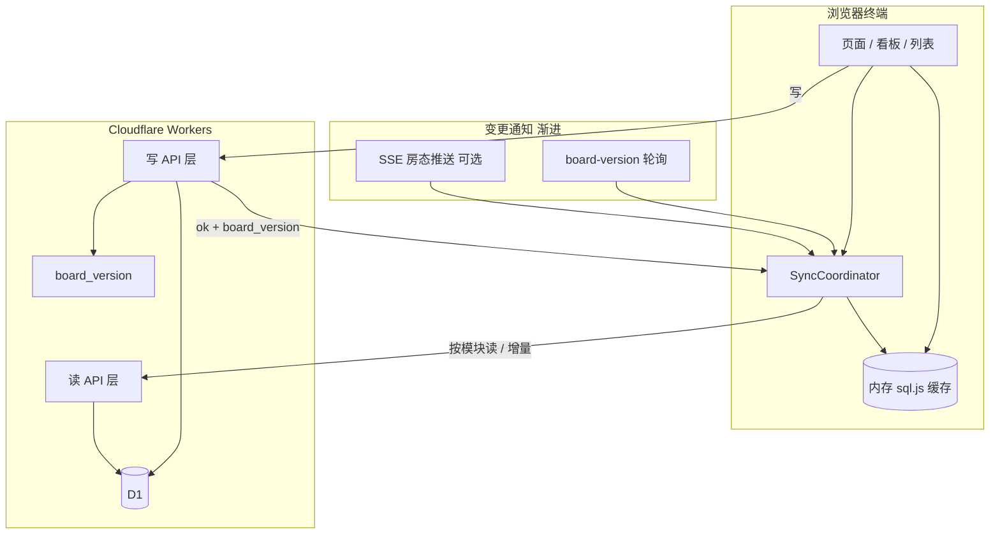

# 多端数据同步与读模型架构规划（v2）

> **状态：** 已实施（Phase 12，2026-07）  
> **适用：** Cloudflare Pages + Functions + D1 在线多人模式  
> **约束：** 保持原生 HTML/CSS/JS、无运行时构建链；本地 IndexedDB 模式保留为灾备/开发

---

## 1. 背景与问题

### 1.1 现状（as-is）

| 维度       | 当前实现                                                                |
| ---------- | ----------------------------------------------------------------------- |
| 权威数据源 | Cloudflare D1                                                           |
| 写路径     | `/api/v1/*`、`/api/v1/admin/records` 等业务 API                         |
| 读路径     | 登录后 `GET /api/v1/read-model` 全表快照 → 灌入浏览器内存 sql.js        |
| 变更通知   | `app_meta.board_version` + 客户端每 8s 轮询 `GET /api/v1/board-version` |
| 写后刷新   | `refreshAfterWrite()` → `renderAll({ forceSync: true })` 强制全量重拉   |
| 本地模式   | `localhost` / `file://` 仍用 IndexedDB + 完整 migration                 |

### 1.2 已暴露的痛点

1. **同步粒度过粗**：每次登录、刷新、写操作常触发全量快照，数据量上来后等待 10s+。
2. **多端无协调**：各终端独立全量拉取，同时操作时出现叠加等待。
3. **视图刷新不完整**：`renderAll()` 未覆盖「信息管理 → 营期」等页，后台已同步但 UI 仍显示旧列表。
4. **写后语义不清**：删除营期等操作云端已成功，本地列表未更新，二次操作报「不存在」易被理解为失败。
5. **ETag 未充分利用**：写后 `forceSync` 跳过 `304`，性能优化收益被抵消。

### 1.3 目标（to-be，对齐业内成熟 PMS / 协作后台）

| 原则             | 说明                                                                    |
| ---------------- | ----------------------------------------------------------------------- |
| **写读分离**     | 写走业务 API；读按页面/模块拉取，避免「整库灌入」为默认路径             |
| **单一真相源**   | D1 仍为唯一权威；浏览器 sql.js 降级为**缓存与查询引擎**，非第二份真相源 |
| **变更可定位**   | 每次写返回 `board_version`；客户端知道「要不要同步、同步哪一块」        |
| **当前视图优先** | 用户正在看的列表/看板，在版本变化后必须自动重绘                         |
| **渐进增强**     | 先修契约与刷新，再拆读 API，最后增量/推送；每阶段可独立验收             |
| **本地模式不变** | 离线/灾备仍用现有 IndexedDB 路径，不与在线同步架构耦合                  |

### 1.4 非目标（本规划不做）

- 多租户 SaaS、外部账号注册
- 完整离线编辑 + 冲突合并（CRDT / OT）
- 引入 React/Vue、Webpack/Vite 运行时
- Electron / 原生 App
- 默认接入短信/微信/企业微信（仍随 Phase 4 公开预约单独立项）

---

## 2. 目标架构总览



### 2.1 三层职责

| 层                            | 职责                                             | 成熟产品对标            |
| ----------------------------- | ------------------------------------------------ | ----------------------- |
| **Write API**                 | 校验、权限、事务/batch、审计、`bumpBoardVersion` | 酒店 PMS 业务服务层     |
| **Read API**                  | 按域返回 JSON（看板、在住、营期、设置…）         | 民宿 SaaS 列表/详情接口 |
| **SyncCoordinator（客户端）** | 版本比对、拉取策略、灌缓存、触发当前视图 refresh | 前台终端同步代理        |

### 2.2 数据流（目标态）

1. 用户操作 → `POST /api/v1/...` → D1 事务提交 → 响应 `{ ok: true, board_version: N }`
2. `SyncCoordinator` 更新本地 `lastBoardVersion`
3. 若当前页需要最新数据：调用**模块读 API** 或**表级增量**更新缓存，再 `renderXxx()`
4. 其他终端：`board-version` 轮询（或 SSE）发现 `N` 变化 → 同样按**当前视图**拉取，非默认全量

**全量 `read-model` 保留用途：** 登录后冷启动、手动「强制同步」、灾备恢复后校验——不再是每次写后的默认路径。

---

## 3. 分阶段实施计划

建议作为 **Phase 12：同步与读模型 v2**，插入在 Phase 9 验收之后、Phase 4 公开预约之前（公开预约会放大量写读，应先有稳定同步）。

| 子阶段   | 名称                 | 工期（估） | 依赖         |
| -------- | -------------------- | ---------- | ------------ |
| **12.1** | 同步热修复与写契约   | 2–3 天     | Phase 9 收尾 |
| **12.2** | 智能刷新与视图注册   | 3–4 天     | 12.1         |
| **12.3** | 模块读 API           | 1–2 周     | 12.2         |
| **12.4** | 表级增量同步         | 1–2 周     | 12.3         |
| **12.5** | 房态实时推送（可选） | 3–5 天     | 12.3         |

---

## 4. Phase 12.1 — 同步热修复与写契约

**目标：** 消除「删了却报失败 / 他端仍看见」类问题；统一写响应；减少无谓全量同步。

### 4.1 服务端

| 任务             | 说明                                                                       |
| ---------------- | -------------------------------------------------------------------------- |
| 写操作原子 batch | `deleteEvent` 等：`DELETE` + `audit_logs` + `board_version` 同一 `batchD1` |
| 统一写响应形状   | 所有 mutating API 返回 `{ ok: true, board_version: number, ...payload }`   |
| 辅助函数         | `functions/_shared/write-response.js`：`finishWrite(env, extra)`           |

### 4.2 客户端

| 任务                                    | 说明                                                     |
| --------------------------------------- | -------------------------------------------------------- |
| 删除/保存后 `await refreshAfterWrite()` | 营期、房间、床位等 settings 写路径                       |
| `refreshAfterWrite` 智能同步            | 若响应含 `board_version` 且与本地相同 → 跳过拉取，只重绘 |
| 否则先 `GET board-version`              | 未变则 `304`/跳过重拉；变了再 `syncRemoteReadModel`      |
| 权限与按钮                              | 无 `settings.write` 不渲染删除/编辑营期按钮              |
| `renderAll` 补全                        | `view-info` 激活时 `renderInfo(infoCurrentTab)`          |

### 4.3 验收

- [ ] 知客删空营期：一次成功，列表立即消失，无二次「不存在」误报
- [ ] 管理员停留营期页：知客删除后 ≤8s（或写后本端）列表自动更新
- [ ] 写操作后若 `board_version` 未变，网络面板无全量 `read-model` 请求
- [ ] `python3 test_headless.py` + 双人手动路径通过

---

## 5. Phase 12.2 — 智能刷新与视图注册

**目标：** 对标成熟产品「当前屏幕跟版本走」；写后等待时间明显下降。

### 5.1 SyncCoordinator（新模块 `js/sync-coordinator.js`）

职责集中，避免 `db.js` / `app.js` / 各业务文件散落同步逻辑：

```text
syncAfterWrite(writeResult?)
  → compare board_version
  → decide: skip | full | module

registerViewRefresh(viewId, fn)   // 如 'board', 'info:events', 'lodgers'
notifyViewsChanged(changedDomains) // ['events'] → 只调相关 fn

syncRemoteReadModel(options)
  → 保留现有全量路径，加 { tables?: string[] } 预留
```

### 5.2 变更域（domain）枚举

| domain         | 典型表                                                 | 触发刷新的视图               |
| -------------- | ------------------------------------------------------ | ---------------------------- |
| `board`        | rooms, beds, lodgers, housekeeping, app_meta（运营键） | 房态看板、首页 KPI、查房开关 |
| `lodging`      | lodgers, guests, beds, payments                        | 在住、历史、登记、支付       |
| `events`       | events, rooming_*                                      | 营期管理、排房、预报         |
| `reservations` | reservations                                           | 预约                         |
| `meals`        | meals, lodgers                                         | 用斋                         |
| `settings`     | rooms, beds, guests                                    | 信息管理各 tab               |

写 API 响应增加可选字段：`changed_domains: ['events']`（12.1 可先写死映射，12.3 由服务端显式返回）。

### 5.3 轮询优化

- 轮询间隔：看板页 8s；非看板页 20s；后台标签页暂停（`document.hidden`）
- 版本未变：不调用 `read-model`
- 版本变化：12.1 仍全量；12.3 起改为 domain 拉取

### 5.4 验收

- [ ] 在住页改备注：不触发全量 read-model（12.3 前至少不 force etag=null）
- [ ] 看板页他人入住：8s 内房态更新
- [ ] 营期页他人删营期：当前页自动更新，无需 F5
- [ ] 同步横幅仅在真正拉取时出现

---

## 6. Phase 12.3 — 模块读 API

**目标：** 对标酒店 PMS / 民宿 SaaS 的「按页查库」；全量快照退居冷启动。

### 6.1 新读接口（`functions/api/v1/read/`）

| 路径                                  | 用途                              | 权限               |
| ------------------------------------- | --------------------------------- | ------------------ |
| `GET /api/v1/read/board`              | 房态看板（房间/床/在住/房务摘要） | `board.read`       |
| `GET /api/v1/read/lodgers`            | 在住列表 + 分页/筛选 query        | `lodging.read`     |
| `GET /api/v1/read/events`             | 营期列表 + 统计字段               | `lodging.read`     |
| `GET /api/v1/read/event/:id`          | 单营期 + 排房 bundle              | `lodging.read`     |
| `GET /api/v1/read/reservations`       | 预约列表                          | `reservation.read` |
| `GET /api/v1/read/meals?date=`        | 某日用餐                          | `meals.read`       |
| `GET /api/v1/read/settings/:resource` | rooms/beds/guests 设置列表        | `settings.read`    |

约定：

- 响应均含 `board_version`、`synced_at`
- 支持 `If-None-Match: <board_version>` → `304`
- 列表接口支持 `?since_version=` 预留（12.4 启用）

### 6.2 客户端策略

| 场景     | 行为                                                 |
| -------- | ---------------------------------------------------- |
| 登录     | 全量 `read-model` 一次（或并行拉各 module 拼成缓存） |
| 打开房态 | `read/board` 若 version 匹配则跳过                   |
| 打开营期 | `read/events`                                        |
| 写后     | 按 `changed_domains` 只拉对应 module，patch 本地表   |

### 6.3 与现有 sql.js 的关系

- **短期（12.3）：** 模块 JSON 仍灌入 sql.js，复用现有 `query()` 与报表逻辑，降低重写成本
- **中期：** 高频列表（在住、营期）可直渲染 API JSON，sql.js 仅服务复杂报表/导出

### 6.4 验收

- [ ] 打开营期管理：首屏 ≤3s（P95，生产预览域）
- [ ] 登录后全量仍 ≤25s（与现基线一致）
- [ ] 日常写操作后网络请求仅为 `board-version` + 1 个 module API
- [ ] `test_api_structure.py` 覆盖新路由

---

## 7. Phase 12.4 — 表级增量同步

**目标：** 对标协作产品的 `changes since`；登录后日常不再全表 DELETE/INSERT。

### 7.1 服务端

新增 `app_meta.sync_epoch` 或复用 `board_version` 作为全局序：

**方案 A（推荐，实现简单）：** 每张业务表增加 `updated_at TEXT` + 写路径统一 touch；  
`GET /api/v1/sync/delta?since=<version>` 返回各表 `WHERE updated_at > ?` 的行 + `deleted_ids`（软删表用 `deleted_at`）。

**方案 B（更重）：** `change_log` 表追加 `(version, table, op, pk, payload_json)`；适合审计与回放，D1 写入量更大。

客堂规模（数百床位、数千挂单）**方案 A 足够**。

### 7.2 客户端 `applyDelta(payload)`

- 对每张表：`UPSERT` 变更行；对 deletes 执行 `DELETE`
- 不再 `DELETE FROM table` 全表清空
- 若 delta 应用失败或 gap 过大：`fallbackFullSync()`

### 7.3 Migration

- schema v21：`updated_at` 列 + backfill `created_at` 或当前时间
- 写 API 统一 `touchRow(table, id)`

### 7.4 验收

- [ ] 1000+ 挂单库：增量同步 P95 ≤2s
- [ ] 连续 20 次写操作无全量 read-model（监控网络）
- [ ] 强制全量同步菜单仍可用（系统设置）

---

## 8. Phase 12.5 — 房态实时推送（可选）

**目标：** 看板对标前台 PMS 近实时；其余页面继续轮询/module 读。

### 8.1 技术选型（Cloudflare 友好）

| 选项                               | 优点                       | 缺点                    |
| ---------------------------------- | -------------------------- | ----------------------- |
| **SSE** `GET /api/v1/stream/board` | Workers 原生支持、实现简单 | 每连接占 Worker；需心跳 |
| 短轮询 3s（仅看板页）              | 零新基础设施               | 仍非真推送              |
| Durable Objects + WebSocket        | 真双向                     | 复杂度与成本上升        |

**建议：** 先做看板页 3s 轮询 `read/board`（12.3 后很轻）；夏季高峰前再评估 SSE。

### 8.2 验收

- [ ] 看板页他人入住：≤3s 可见（SSE）或 ≤5s（优化轮询）
- [ ] 非看板页不因推送增加流量

---

## 9. API 契约（写响应标准）

所有 mutating `/api/v1/*` 在 12.1 完成后统一：

```json
{
  "ok": true,
  "board_version": 1284,
  "changed_domains": ["events"],
  "data": {}
}
```

错误：

```json
{
  "ok": false,
  "error": "该营期下还有 3 条记录，无法删除。",
  "board_version": 1284
}
```

客户端规则：

1. `ok: false` → 提示错误，**不**本地乐观删除
2. `ok: true` → 更新 `lastBoardVersion`，按 `changed_domains` 刷新
3. 无 `changed_domains` → 仅 `board-version` 比对后决定

---

## 10. 性能预算（更新）

在 `docs/ops/performance-baseline.json` 增补（12.3 起启用）：

| 指标                        | 目标 P95             |
| --------------------------- | -------------------- |
| `read/board`                | ≤ 3s                 |
| `read/events`               | ≤ 2s                 |
| `sync/delta`                | ≤ 2s                 |
| `read-model` 全量（冷启动） | ≤ 25s（维持）        |
| `read-model` 304            | ≤ 5s（维持）         |
| 写后用户感知等待            | ≤ 1.5s（不含冷启动） |

---

## 11. 测试与验收矩阵

| 类型   | 内容                                                             |
| ------ | ---------------------------------------------------------------- |
| 自动化 | 扩展 `test_api_structure.py`、契约测试写响应含 `board_version`   |
| 多人   | 沿用 `final-acceptance-checklist.md` §1–3，补充营期删除/编辑场景 |
| 性能   | `test_prod_latency.py` 增加 module/delta 探测                    |
| 回归   | 本地 IndexedDB 模式全套 headless 仍通过                          |

---

## 12. 风险与缓解

| 风险                              | 缓解                                             |
| --------------------------------- | ------------------------------------------------ |
| 拆读 API 与 sql.js 报表逻辑不一致 | 12.3 仍灌 sql.js；单测对比 module 与全量快照行数 |
| `updated_at` migration 漏 touch   | 写路径集中 helper；CI 检查 mutation 是否调用     |
| 增量 gap 导致脏缓存               | version 回退或 delta 过大时自动全量              |
| SSE 连接数                        | 仅看板页、仅在线用户；降级轮询                   |
| 工期膨胀                          | 严格分阶段；12.1 可独立上线                      |

---

## 13. 与路线图关系

建议更新 `docs/roadmap.md` 阶段表：

| 阶段         | 名称                | 说明                           |
| ------------ | ------------------- | ------------------------------ |
| Phase 9      | 夏季活动排房        | 当前收尾 + 验收清单            |
| **Phase 12** | **同步与读模型 v2** | 本文 12.1–12.5                 |
| Phase 4      | 公开预约            | 依赖 12.1 至少、推荐 12.3 完成 |
| 最终总验收   |                     | 性能项改用 §10 新指标          |

---

## 14. 建议执行顺序（拍板）

1. **立即（本周）：** 12.1 热修复 — 成本低，直接解决现场报障
2. **Phase 9 验收后：** 12.2 视图注册 + 轮询优化
3. **Phase 4 前：** 12.3 模块读 API（公开预约读写频繁）
4. **数据量/夏季前：** 12.4 增量同步
5. **按需：** 12.5 看板 SSE

---

## 15. 确认项（2026-07-02 已拍板）

- [x] **全量 `read-model` 仅保留「设置 → 强制同步云端数据」+ 登录冷启动**（日常写操作后按 `board_version` 按需同步，不再默认 `forceSync` 全量）
- [x] **高级知客（`is_advanced`）允许营期增删改**（含 `settings.write`；普通知客无此权限，UI 隐藏编辑/删除）
- [x] **看板刷新目标 ≤3s**（`board-version` 轮询 3s；后台标签页暂停轮询）
- [x] **Phase 12 为 Phase 4 公开预约前置条件**（至少完成 12.1–12.3 后再开 Phase 4）

---

## 16. 实施状态

| 子阶段 | 状态       | 备注                                                                  |
| ------ | ---------- | --------------------------------------------------------------------- |
| 12.1   | **已完成** | 写契约、deleteEvent 原子 batch、sync-coordinator、3s 轮询、营期页刷新 |
| 12.2   | **已完成** | 视图注册、轮询分级（看板 3s / 其他 20s）、SSE 钩子                    |
| 12.3   | **已完成** | 模块读 API + 写后按域拉取                                             |
| 12.4   | **已完成** | sync_domain_log + delta API + 客户端 applyRemoteDelta                 |
| 12.5   | **已完成** | 看板 SSE `/api/v1/stream/board`（3s 内推送版本变化）                  |

---

**文档维护：** 每完成子阶段更新本节状态，并在 `docs/cloudflare-online-mode.md` 同步 API 表。
